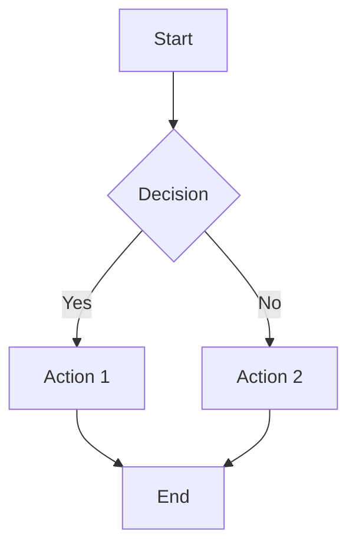
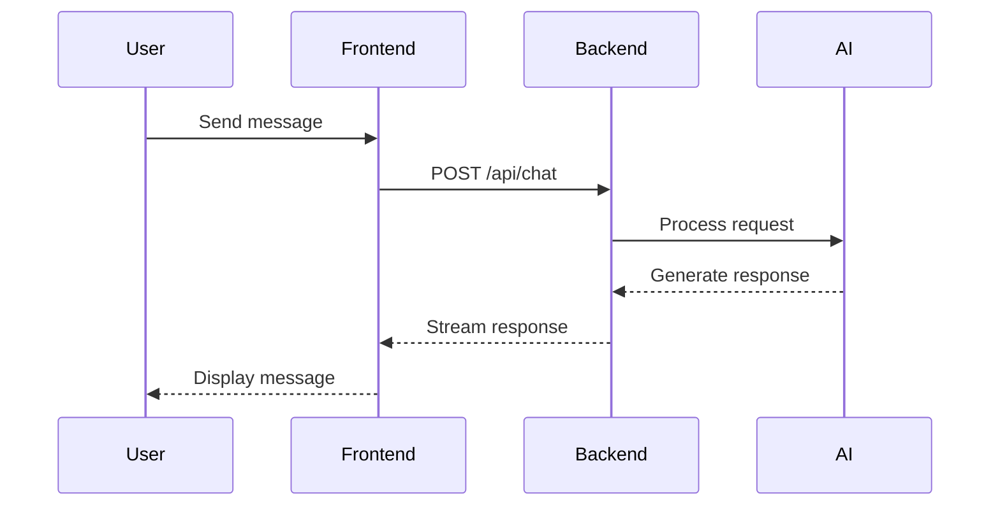
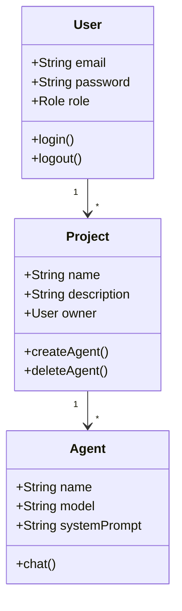
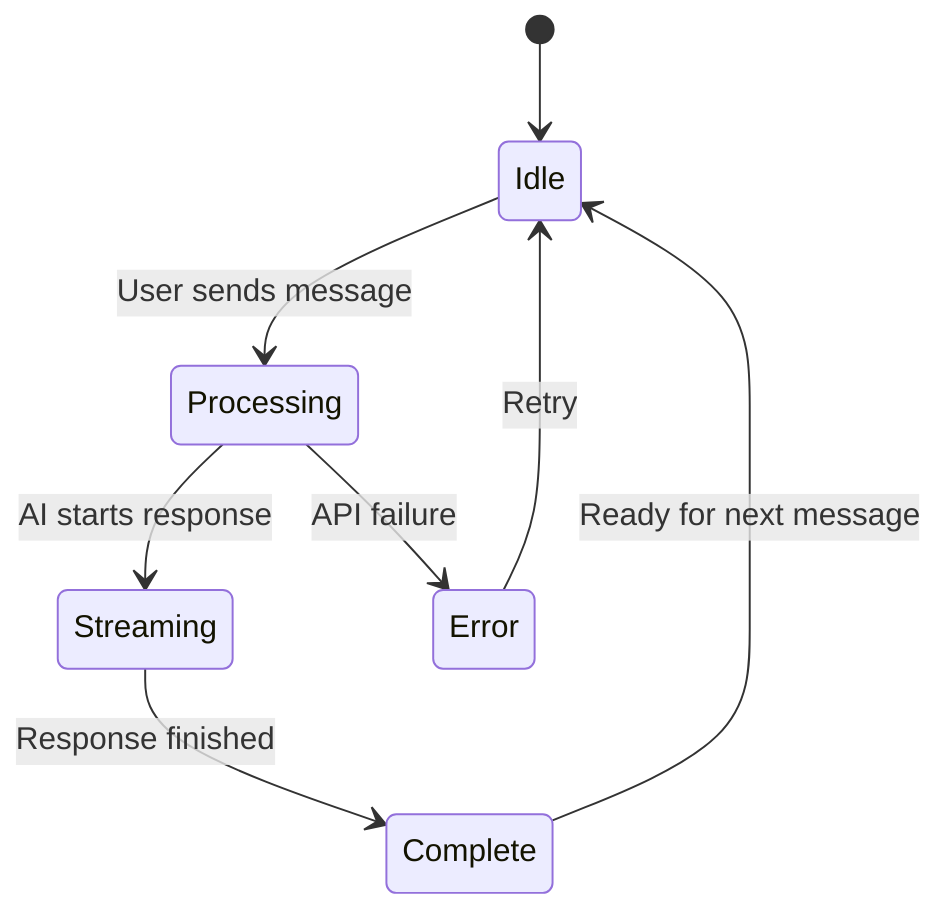
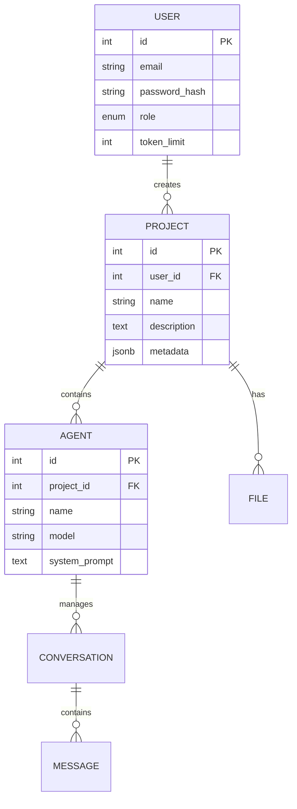
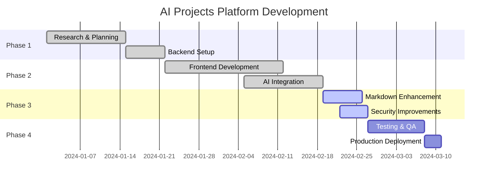
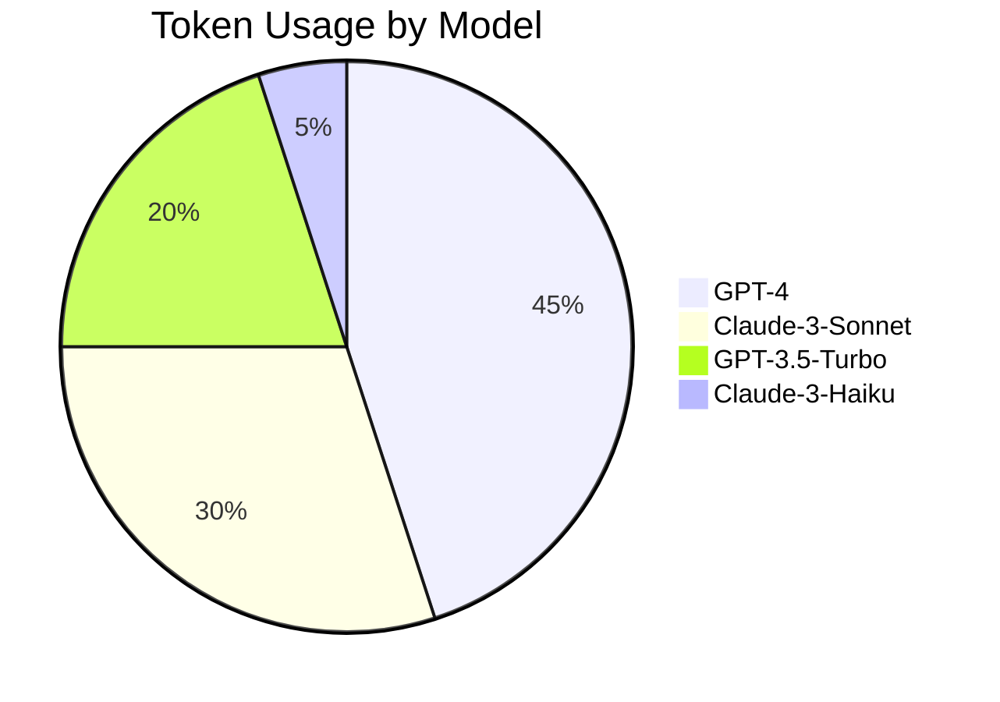
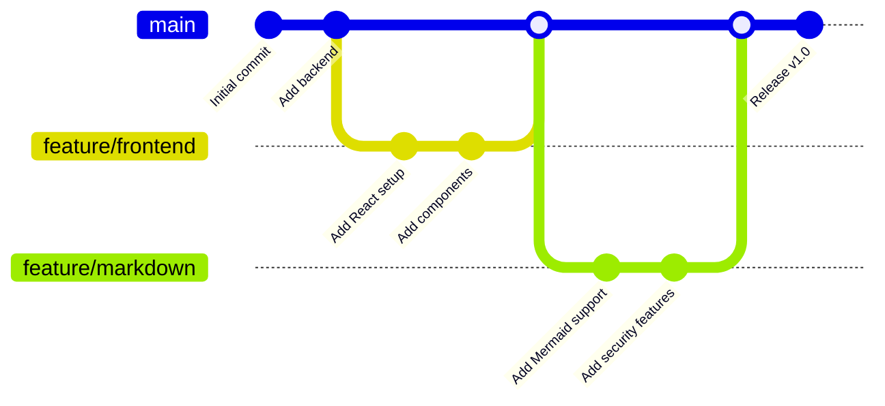
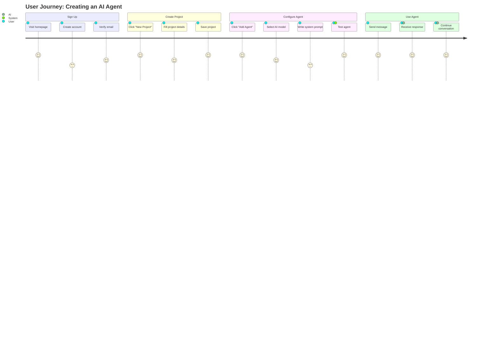
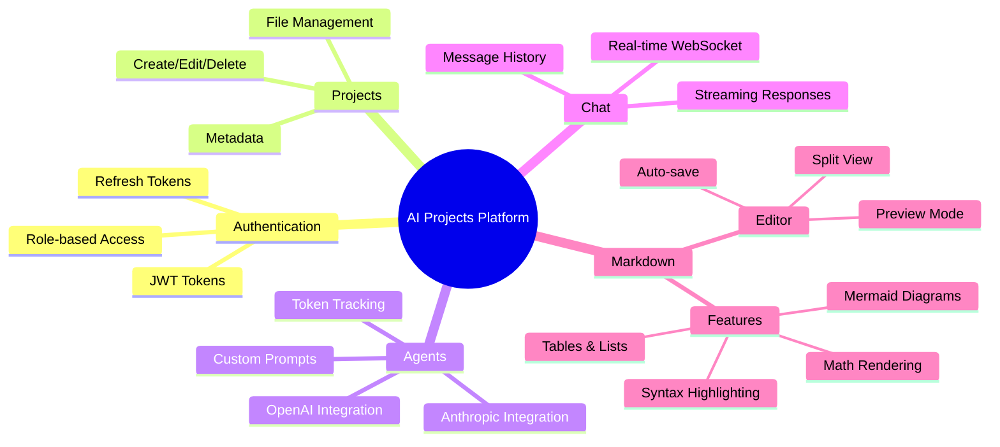

# Mermaid Diagram Examples

This document demonstrates the various types of Mermaid diagrams now supported in the AI Projects Platform.

## 1. Flowchart



## 2. Sequence Diagram



## 3. Class Diagram



## 4. State Diagram



## 5. Entity Relationship Diagram



## 6. Gantt Chart



## 7. Pie Chart



## 8. Git Graph



## 9. User Journey



## 10. Mindmap



## Security Features

All markdown content is now sanitized using `rehype-sanitize` to prevent XSS attacks. This includes:

- ✅ Safe HTML rendering
- ✅ Script tag filtering
- ✅ Event handler removal
- ✅ Dangerous attribute sanitization

## Math Support

The platform also supports KaTeX math rendering:

Inline math: $E = mc^2$

Block math:

$$
\sum_{i=1}^{n} i = \frac{n(n+1)}{2}
$$

## Code Highlighting

```typescript
// TypeScript example with syntax highlighting
interface MermaidDiagramProps {
  chart: string;
  id?: string;
}

export function MermaidDiagram({ chart, id }: MermaidDiagramProps) {
  const [svg, setSvg] = useState<string>('');
  return <div className="mermaid-wrapper" dangerouslySetInnerHTML={{ __html: svg }} />;
}
```

```python
# Python example
def fibonacci(n):
    if n <= 1:
        return n
    return fibonacci(n-1) + fibonacci(n-2)

print(fibonacci(10))
```

## Testing Instructions

1. Create or edit a markdown file in the platform
2. Click the new **Mermaid diagram** button in the toolbar
3. The template will be inserted with a sample flowchart
4. Modify the diagram code and see it render in the preview pane
5. Try different diagram types from the examples above
6. Export to PDF to see diagrams in exported documents

## Notes

- Mermaid diagrams render with **strict security level** to prevent XSS
- Diagrams automatically adapt to light/dark mode
- Invalid diagram syntax will show a clear error message with details
- All diagrams are responsive and scroll horizontally on mobile devices
