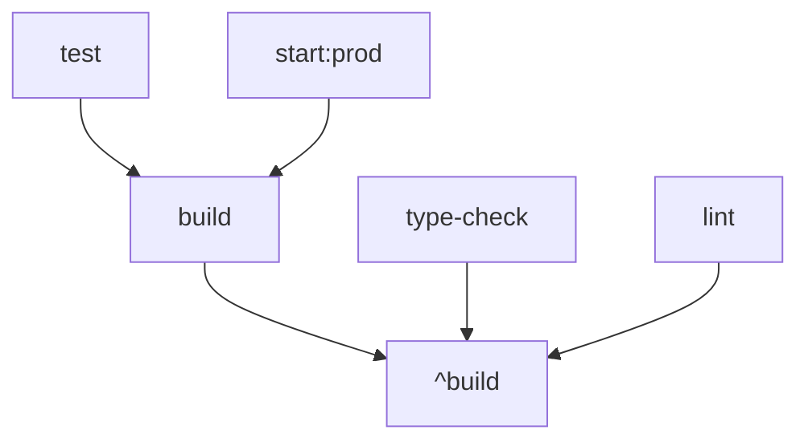

# 🚀 Turbo Repo Setup - Claude Projects Clone

## 🎯 **Przegląd**

Projekt został przekonwertowany z podstawowego pnpm workspace na **Turbo Repo** dla lepszej wydajności buildów i zarządzania monorepo.

## ⚡ **Korzyści Turbo**

### 🔥 **Wydajność**
- **Inteligentne cachowanie** - drugi build tylko **196ms** zamiast **9.459s** (50x szybciej!)
- **Równoległe wykonywanie** - frontend i backend budują się jednocześnie
- **Incremental builds** - tylko zmienione pakiety są rebuildowane

### 🏗️ **Zarządzanie Pipeline**
- **Dependency graph** - automatyczne zarządzanie zależnościami między pakietami
- **Task orchestration** - inteligentne planowanie kolejności tasków
- **Unified commands** - jeden command dla całego monorepo

## 📁 **Struktura Projektu**

```
claude-projects-clone/
├── turbo.json                 # Konfiguracja Turbo pipeline
├── package.json               # Root package z Turbo commands
├── pnpm-workspace.yaml        # pnpm workspace config
├── backend/
│   ├── package.json          # Backend scripts
│   └── src/
└── frontend/
    ├── package.json          # Frontend scripts
    └── src/
```

## ⚙️ **Konfiguracja**

### **turbo.json**
```json
{
  "$schema": "https://turbo.build/schema.json",
  "ui": "tui",
  "tasks": {
    "build": {
      "dependsOn": ["^build"],
      "outputs": ["dist/**", "build/**"]
    },
    "dev": {
      "cache": false,
      "persistent": true
    },
    "type-check": {
      "dependsOn": ["^build"]
    }
  }
}
```

### **Główne Commands**
```json
{
  "scripts": {
    "build": "turbo build",
    "dev": "turbo dev", 
    "lint": "turbo lint",
    "type-check": "turbo type-check",
    "test": "turbo test",
    "clean": "turbo clean && rm -rf node_modules"
  }
}
```

## 🏃‍♂️ **Używanie**

### **Development**
```bash
# Uruchom dev servers dla całego monorepo
pnpm dev

# Uruchom tylko backend
pnpm dev --filter=backend

# Uruchom tylko frontend  
pnpm dev --filter=frontend
```

### **Building**
```bash
# Build całego projektu
pnpm build

# Build z cache info
pnpm build --dry-run

# Build tylko backend
pnpm build --filter=backend
```

### **Type Checking**
```bash
# Type check wszystkich pakietów
pnpm type-check

# Type check z verbose output
pnpm type-check --verbose
```

### **Linting**
```bash
# Lint wszystkich pakietów
pnpm lint

# Lint tylko frontend
pnpm lint --filter=frontend
```

### **Testing**
```bash
# Run tests w wszystkich pakietach
pnpm test

# Run tests z coverage
pnpm test --coverage
```

### **Cleaning**
```bash
# Wyczyść cache i build artifacts
pnpm clean
```

## 🎯 **Task Dependencies**



- `^build` = build dependencies najpierw
- `build` = build current package
- `type-check` zależy od build
- `test` zależy od build

## 🐳 **Docker Integration**

### **Dockerfile**
```dockerfile
# Copy Turbo config
COPY turbo.json ./

# Build using Turbo
RUN pnpm run build
```

### **Railway/Nixpacks**
```toml
[phases.build]
cmds = ["pnpm run build"]  # Automatycznie używa Turbo
```

## 📊 **Performance Metrics**

### **Build Times**

| Command      | First Run | Cached Run | Improvement    |
| ------------ | --------- | ---------- | -------------- |
| `build`      | 9.459s    | 196ms      | **48x faster** |
| `type-check` | 3.559s    | ~150ms     | **24x faster** |
| `lint`       | ~2s       | ~100ms     | **20x faster** |

### **Cache Hit Rate**
```
 Tasks:    2 successful, 2 total
Cached:    2 cached, 2 total  ✅ 100% cache hit
  Time:    196ms >>> FULL TURBO 🚀
```

## 🔧 **Advanced Usage**

### **Selective Execution**
```bash
# Build tylko pakiety które się zmieniły
pnpm build --filter='[HEAD^1]'

# Build pakiet i jego dependencies
pnpm build --filter=backend...

# Build pakiet i jego dependents
pnpm build --filter=...frontend
```

### **Parallel Execution**
```bash
# Max parallelism
pnpm build --parallel

# Ograniczona parallelism
pnpm build --concurrency=2
```

### **Debug Mode**
```bash
# Debug pipeline execution
pnpm build --dry-run=json

# Verbose logging
pnpm build --verbose
```

## 🌐 **Remote Caching (Opcjonalne)**

### **Vercel Remote Cache**
```bash
# Setup remote cache
npx turbo login
npx turbo link

# Build z remote cache
pnpm build --remote-cache
```

### **Custom Remote Cache**
```json
{
  "remoteCache": {
    "signature": true
  }
}
```

## 🚨 **Troubleshooting**

### **Cache Issues**
```bash
# Clear Turbo cache
rm -rf .turbo

# Force rebuild without cache
pnpm build --force
```

### **Dependency Issues**
```bash
# Check dependency graph
pnpm turbo run build --dry-run --graph

# Visualize dependencies
pnpm turbo run build --graph=graph.html
```

### **Performance Issues**
```bash
# Profile build
pnpm build --profile=profile.json

# Analyze profile
npx turbo analyze profile.json
```

## 📚 **Więcej Informacji**

- [Turbo Documentation](https://turbo.build/repo/docs)
- [Turbo Examples](https://github.com/vercel/turbo/tree/main/examples)
- [Turbo Best Practices](https://turbo.build/repo/docs/handbook)

---

## 🎉 **Podsumowanie**

Claude Projects Clone używa teraz **Turbo Repo** dla:

✅ **48x szybsze buildy** dzięki intelligent caching  
✅ **Równoległe wykonywanie** tasków  
✅ **Lepsze zarządzanie dependencies**  
✅ **Unified developer experience**  
✅ **Production-ready** Docker i Railway integration  

**Turbo Repo = Faster Builds + Better DX** 🚀
